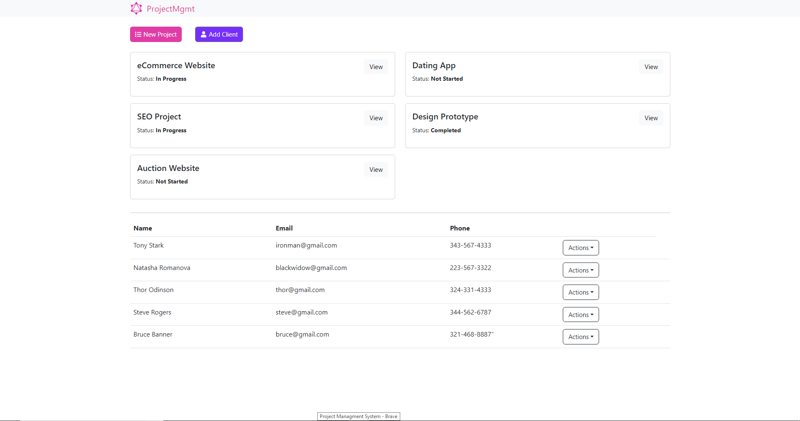

<h2 align="center">MERN GraphQL Project Management System</h2>

### 📋 About the project

O projeto foi realizado visando aprender GraphQL de forma prática.

Minha referência foi o Brad Traversy!

Sobre o app, sendo um simples Sistema de Gerenciamento de Projetos, você pode ler, criar, editar e deletar projetos, bem como ler, criar, editar e deletar clientes.

Cada projeto necessita ter um cliente anexado, portanto ao deletar um cliente, todos os projetos relacionados ao mesmo também serão deletados.

---

    

### Para uma melhor experiência, teste você mesmo - [Project Management System](https://abms-mgmt-system-app.onrender.com)
---
### 🚀 Technologies

- [GraphQL](https://graphql.org/)
- [Apollo](https://www.apollographql.com/)
- [React.js](https://reactjs.org/)
- [React Router DOM](https://www.npmjs.com/package/react-router-dom)
- [react-icons](https://react-icons.github.io/react-icons/)
- [Bootstrap](https://getbootstrap.com/)
- [Node.js](https://nodejs.org/en/)
- [MongoDB](https://www.mongodb.com/cloud)
- [mongoose](https://mongoosejs.com/)
- [Express](https://expressjs.com/pt-br/)
- [express-graphql](https://www.npmjs.com/package/express-graphql)
- [cors](https://www.npmjs.com/package/cors)
- [dotenv](https://www.npmjs.com/package/dotenv)
- [helmet](https://www.npmjs.com/package/helmet)

---
### 👉 [See my Linkedin](https://www.linkedin.com/in/alisson-modesto-fullstack-developer/)
